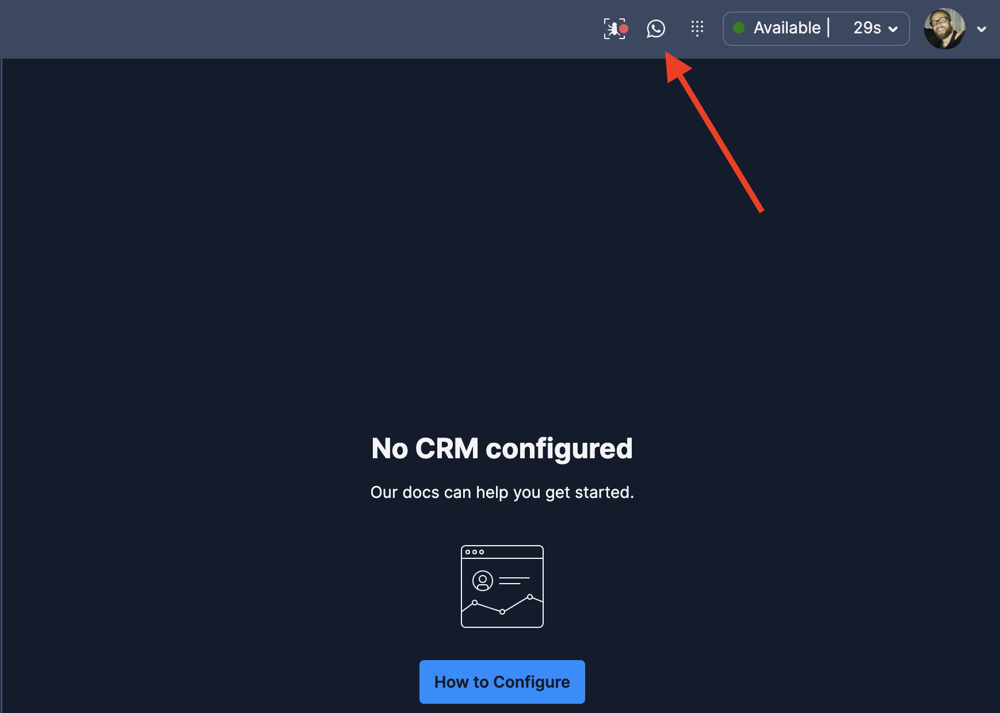
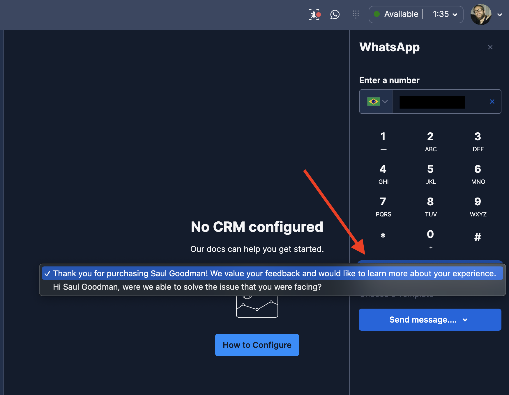
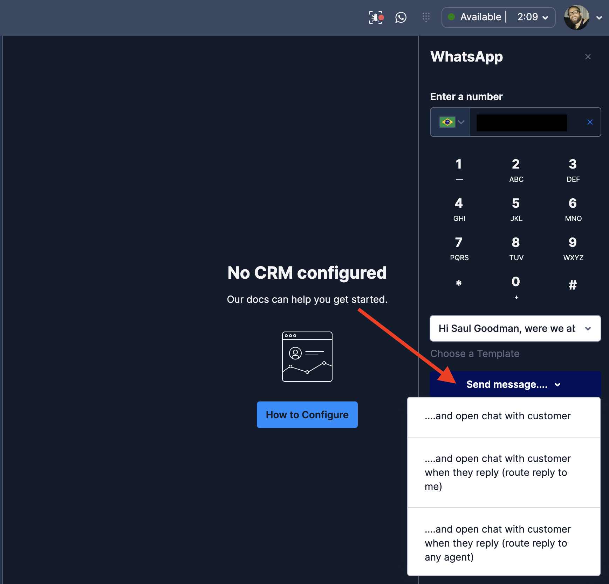

# Twilio Flex Conversations Outbound WhatsApp Plugin

## Disclaimer

**This software is to be considered "sample code", a Type B Deliverable, and is delivered "as-is" to the user. Twilio bears no responsibility to support the use or implementation of this software.**

## Important note

To use this plugin you need to have Flex Conversations enabled on your account as well as Flex UI 2.0. Please read our doc for more details about it: https://www.twilio.com/docs/flex/developer/conversations

## Information about the plugin

This plugin is based in the instructions given on our doc on how to [Send Outbound Messages via WhatsApp](https://www.twilio.com/docs/flex/developer/conversations/send-outbound-messages-via-sms-and-whatsapp#outbound-whatsapp).

**Please Note: Meta requires you to create outbound templates in order for an agent to initiate contact. Free text will not be delivered in the initial contact. After that, free text is allowed inside the 24h window rule. But keep in mind: For an agent-initiated conversation, it is a best practice to always make the first contact through a template, even inside the 24h window. [More information about WhatsApp Templates and its rules here.](https://www.twilio.com/docs/whatsapp/tutorial/send-whatsapp-notification-messages-templates)**

It adds a WhatsApp icon to your Main Header:



With a drop down select for your templates:



And a possibility to send outbound whatsapp messages in 3 different ways:



## Customization

For example purposes, this plugin comes with hard coded templates which are added in the `src/utils/templates.js` file. Feel free to maintain the same logic by pasting your templates there or change the whole logic to your needs.

## Setup

### Twilio Serverless Functions

This plugin includes a service used to park/unpark/close the interactions using Twilio Functions. Make sure you have the [Twilio Serverless Toolkit](https://www.twilio.com/docs/labs/serverless-toolkit/getting-started) installed before proceding.

After installing it correctly, follow the procedure below:

```bash
cd serverless-outbound-whatsapp
```

Run

```bash
twilio serverless:deploy
```

### Plugin

First install the dependencies in the plugin's folder:

```bash
# If you are inside the serverless folder, first run: cd ..
cd plugin-outbound-whatsapp

# If you use npm
npm install
```

Create a `.env` file according to the `.env.example`:

```bash
cp .env.example .env
```

Fill the `.env` file accordingly:

| Config&nbsp;Value                 | Description                                                                                                                                                                                                                             |
| :-------------------------------- | :-------------------------------------------------------------------------------------------------------------------------------------------------------------------------------------------------------------------------------------- |
| FLEX_APP_TWILIO_SERVERLESS_DOMAIN | Under Functions and Assets > Services, click in the corresponding service (created in the Twilio Serveless setup above). Inside you will see a function `/sendOutboundWA`. Click on it, then click on Copy URL and paste it in the .env |
| FLEX_APP_WORKSPACE_SID            | TaskRouter Workspace identifier. Obtainable in the console under TaskRouter > Workspaces. Starts with WSxxxx.                                                                                                                           |
| FLEX_APP_WORKFLOW_SID             | The TaskRouter Workflow identifier for the workflow created to route the tasks. Starts with WWxxxx.                                                                                                                                     |
| FLEX_APP_QUEUE_SID                | TaskRouter Queue you will use when routing to any agent. Obtainable in the console under TaskRouter > Workspaces > Task Queues. Starts with WQxxx.                                                                                      |
| FLEX_APP_INBOUND_STUDIO_FLOW      | The Studio Flow you use to Send to Flex. Starts with FWxxx.                                                                                                                                                                             |
| FLEX_APP_TWILIO_FROM_NUMBER       | Your Twilio Phone Number used for Flex. Add in E.164 format. Ex.: +551143214321.                                                                                                                                                        |

Finally, to deploy the plugin, run:

```bash
twilio flex:plugins:deploy --changelog "WRITE YOUR CHANGELOG HERE"
```

You can also run the plugin locally for testing purposes:

```bash
twilio flex:plugins:start
```

### Kudos

Special thanks to [Darren Hamilton](https://github.com/dahamilton) for the assist on building this one.
